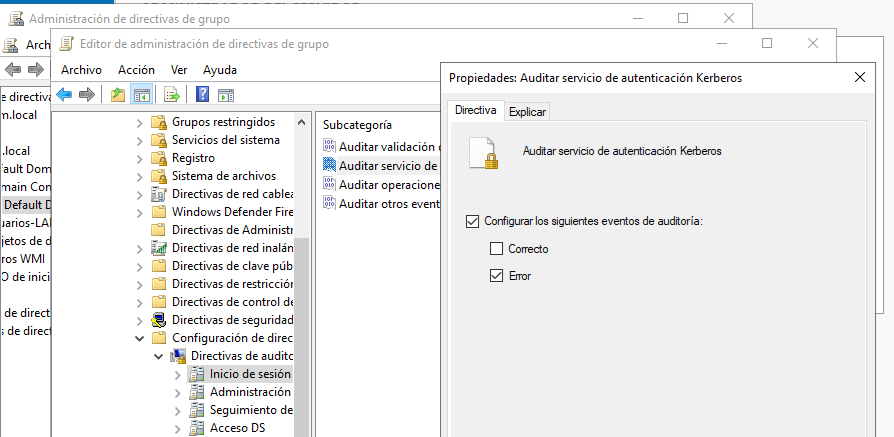
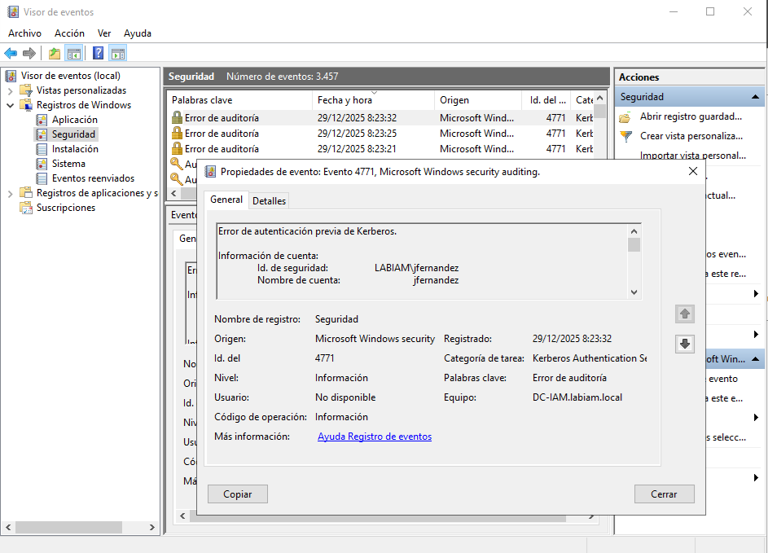

# IAM Incident Handling Lab — Active Directory

## 🇬🇧 English version

## Objective
Simulate and manage a basic Identity and Access Management (IAM) incident in an Active Directory environment, following a realistic security workflow:

Detection → Analysis → Containment → Validation

The purpose of this lab is to demonstrate security reasoning and incident handling, not routine Active Directory administration.

---

## Environment
- Domain Controller: Windows Server
- Client: Windows 10 (domain-joined)
- Domain: labiam.local
- Hypervisor: VirtualBox
- Tools:
  - Active Directory Users and Computers
  - Event Viewer
  - Group Policy Management

---

## Host System Configuration

During the lab setup, a virtualization conflict was identified on the host system.

VirtualBox was unable to start virtual machines due to active Windows virtualization features (Hyper-V and Virtualization-Based Security).

The issue was diagnosed and resolved by disabling the following features on the host system:

- Hyper-V
- Virtual Machine Platform
- Windows Hypervisor Platform
- Virtualization-Based Security (Core Isolation / Memory Integrity)

After rebooting the system, VirtualBox operated normally and the lab environment was successfully deployed.

---

## Identity Preparation
- Creation of a dedicated Organizational Unit (Usuarios-LAB)
- Creation of a standard domain user
- Successful initial login to establish normal behavior

---

## Incident Detection
Multiple failed authentication attempts were generated against a domain user, simulating repeated credential misuse.

During the initial review, no relevant security events were visible.  
Instead of acting without evidence, audit configuration was reviewed first.

---

## Audit Visibility Configuration
Authentication failures were not being logged due to missing advanced audit policies on the Domain Controller.

Audit settings were configured via the Default Domain Controllers Policy:
- Credential Validation — Failure
- Kerberos Authentication Service — Failure

Policies were applied using:
gpupdate /force

This restored visibility into authentication failures.

The following image shows Kerberos authentication auditing enabled via Group Policy on the Domain Controller:

---

## Incident Confirmation
After repeating the failed login attempts, Kerberos event ID 4771 appeared, indicating multiple authentication failures in a short period of time.

This behavior is typical in modern Active Directory environments using Kerberos authentication.

The image below shows a Kerberos authentication failure event recorded in the Windows Security log:

---

## IAM Containment
Once the incident was confirmed, the affected user account was temporarily disabled in Active Directory.

This action immediately stopped further authentication attempts without making destructive changes.

The following image shows the affected domain user account being disabled as a containment measure:

---

## Validation
A login attempt using the correct credentials was blocked, confirming that the containment action was effective.

The image below confirms that the affected user can no longer authenticate after the account was disabled:

---

## Key Takeaways
- Visibility is required before taking action
- Understanding Kerberos-based authentication failures
- Proper IAM workflow: analyze, contain, and verify
- Junior-level execution with real-world reasoning

---

## Status
Lab completed and documented.  
Reusable as a reference case for junior IAM roles.

---

# Laboratorio IAM — Gestión de incidente en Active Directory

## 🇪🇸 Versión en español

## Objetivo
Simular y gestionar un incidente básico de Identidad y Acceso (IAM) en un entorno Active Directory, siguiendo un flujo realista de seguridad:

Detección → Análisis → Contención → Validación

El objetivo del laboratorio es demostrar criterio y toma de decisiones ante un incidente de identidad, no la administración rutinaria de Active Directory.

---

## Entorno
- Controlador de Dominio: Windows Server
- Cliente: Windows 10 unido al dominio
- Dominio: labiam.local
- Hipervisor: VirtualBox
- Herramientas:
  - Usuarios y equipos de Active Directory
  - Visor de eventos
  - Administración de directivas de grupo (GPO)

---

## Configuración del sistema anfitrión

Durante la preparación del laboratorio se detectó un conflicto de virtualización en el sistema anfitrión.

VirtualBox no podía iniciar las máquinas virtuales debido a funcionalidades de virtualización activas en Windows (Hyper-V y seguridad basada en virtualización).

El problema fue analizado y resuelto desactivando las siguientes características del sistema anfitrión:

- Hyper-V
- Plataforma de máquina virtual
- Plataforma del hipervisor de Windows
- Seguridad basada en virtualización (Aislamiento del núcleo / Integridad de memoria)

Tras reiniciar el sistema, VirtualBox funcionó correctamente y el entorno del laboratorio pudo desplegarse con normalidad.

---

## Preparación de identidades
- Creación de una Unidad Organizativa dedicada (Usuarios-LAB)
- Creación de un usuario de dominio estándar
- Inicio de sesión correcto inicial para establecer comportamiento normal

---

## Detección del incidente
Se generaron múltiples intentos fallidos de autenticación contra un usuario de dominio, simulando un uso indebido de credenciales.

En la revisión inicial no aparecían eventos relevantes.  
Antes de actuar, se revisó la configuración de auditoría para asegurar visibilidad.

---

## Configuración de visibilidad y auditoría
Los fallos de autenticación no se estaban registrando debido a una configuración incompleta de la auditoría avanzada en el Controlador de Dominio.

Se ajustaron las políticas de auditoría mediante la Default Domain Controllers Policy:
- Validación de credenciales — Error
- Servicio de autenticación de Kerberos — Error

Tras forzar la aplicación de las políticas, el entorno quedó preparado para la detección real del incidente.

La siguiente imagen muestra la auditoría del servicio de autenticación Kerberos habilitada mediante directiva de grupo en el controlador de dominio:

---

## Confirmación del incidente
Al repetir los intentos fallidos, comenzaron a registrarse eventos Kerberos 4771, indicando múltiples fallos de autenticación en un corto intervalo de tiempo.

Este comportamiento es habitual en entornos Active Directory modernos.

La imagen siguiente muestra un evento de fallo de autenticación Kerberos registrado en el visor de eventos de seguridad:

---

## Contención IAM
Una vez confirmado el incidente, se deshabilitó temporalmente la cuenta de usuario afectada desde Active Directory.

Esta acción detuvo el posible abuso sin eliminar ni modificar permanentemente la identidad.

La siguiente imagen muestra la cuenta de usuario de dominio deshabilitada como medida de contención del incidente:

---

## Validación
El intento de inicio de sesión con credenciales correctas fue bloqueado, confirmando que la contención fue efectiva.

La imagen siguiente confirma que el usuario afectado ya no puede autenticarse tras la deshabilitación de la cuenta:

---

## Conclusiones
Este laboratorio demuestra la importancia de la visibilidad, el análisis previo y la aplicación de medidas de contención controladas en la gestión de incidentes IAM.

---

## Estado
Laboratorio finalizado y documentado.  
Reutilizable como caso práctico para roles junior de IAM.
