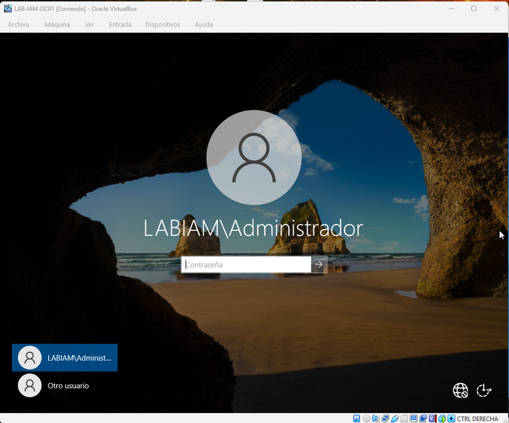
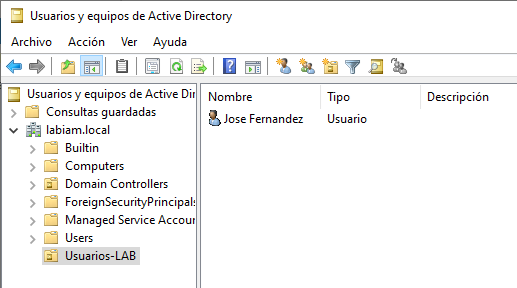

# Incident Walkthrough — IAM Lab (Active Directory)

## 🇬🇧 English version

This document provides a step-by-step walkthrough of the IAM lab, showing the environment state before the incident and the actions performed during the investigation.

---

## Identity and Domain Preparation

A dedicated Organizational Unit and a standard domain user were created to simulate a controlled IAM environment.

---

## Client Joined to the Domain

The client machine was successfully joined to the Active Directory domain.

---

## Normal Authentication (Baseline)

Before the incident, the domain user was able to authenticate successfully, establishing normal behavior.

---

## Incident Trigger

After the baseline was established, failed authentication attempts were generated against the domain user.

The detection, analysis, containment, and validation phases of the incident are documented in the main README.md file.

---

# Guía del incidente — Laboratorio IAM (Active Directory)

## 🇪🇸 Versión en español

Este documento describe paso a paso el desarrollo del laboratorio IAM, mostrando el estado normal del entorno antes del incidente y las acciones realizadas durante la investigación.

---

## Preparación de identidades y dominio

Se creó una Unidad Organizativa dedicada y un usuario de dominio estándar para simular un entorno IAM controlado.

---

## Cliente unido al dominio

El equipo cliente se unió correctamente al dominio de Active Directory.

---

## Autenticación normal (estado base)

Antes del incidente, el usuario de dominio podía iniciar sesión correctamente, estableciendo el comportamiento normal del sistema.

---

## Inicio del incidente

Una vez establecido el estado base, se generaron intentos fallidos de autenticación contra el usuario de dominio.

Las fases de detección, análisis, contención y validación del incidente se documentan en el archivo principal README.md.
